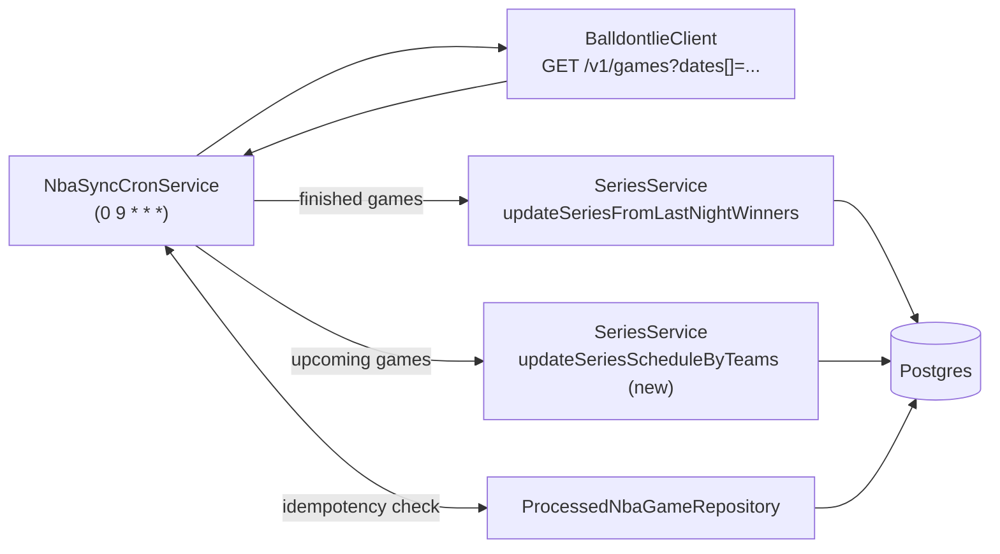

## Goal & constraints

- New cron at `0 9 * * *` Jerusalem time. Lives **alongside** the existing 8/9 AM `last-night-winners` cron in [src/cron/cron.service.ts](src/cron/cron.service.ts) — that one stays untouched.
- External source: balldontlie.io REST API called directly from NestJS (`@nestjs/axios`).
- No new domain entities. Finished games -> increment `BestOf7Bet.seriesScore` via existing `SeriesService.updateSeriesFromLastNightWinners`. Upcoming games -> update `dateOfStart`/`timeOfStart` on existing in-progress `Series` only (no new Series creation).
- One small bookkeeping table is added so the new cron is idempotent and does not double-count games that the existing `last-night-winners` cron may also have processed.

## Architecture




## Files to add

- `src/Integrations/Balldontlie/balldontlie.module.ts` - exports `HttpModule` + `BalldontlieClient`.
- `src/Integrations/Balldontlie/balldontlie.client.ts` - typed wrapper. Methods:
  - `getGamesByDate(date: string): Promise<BalldontlieGameDto[]>`
  - `getGamesByDateRange(startDate: string, endDate: string): Promise<BalldontlieGameDto[]>` (paginates `cursor` until empty)
  - Reads `BALLDONTLIE_BASE_URL` and optional `BALLDONTLIE_API_KEY` from `ConfigService`; sets `Authorization` header when key present.
- `src/Integrations/Balldontlie/dto/balldontlie-game.dto.ts` - shape: `id`, `date`, `status` ("Final" or ISO time), `period`, `home_team_score`, `visitor_team_score`, `home_team{abbreviation}`, `visitor_team{abbreviation}`, `postseason`.
- `src/cron/processed-nba-game.entity.ts` - `@Entity()` with `@PrimaryColumn() externalGameId: string`, `seriesId: string`, `processedAt: Date`. Single-purpose idempotency table.
- `src/cron/processed-nba-game.repository.ts` - extends `Repository<ProcessedNbaGame>`; methods `existsByGameId(id)`, `markProcessed(id, seriesId)`.
- `src/cron/nba-sync.cron.service.ts` - the new `@Cron('0 9 * * *', { timeZone: 'Asia/Jerusalem' })` handler. Calls `syncFinishedGames()` then `syncUpcomingSeriesSchedules()` sequentially in one try/catch per step.

## Files to modify

- `src/config.schema.ts` - add to the Joi schema:

```ts
BALLDONTLIE_BASE_URL: Joi.string().uri().default('https://api.balldontlie.io/v1'),
BALLDONTLIE_API_KEY: Joi.string().optional().allow(''),
```

- `src/data-source.ts` - register `ProcessedNbaGame` in the `entities` array.
- `src/cron/cron.module.ts` - import `BalldontlieModule`, `TeamModule`, and `TypeOrmModule.forFeature([ProcessedNbaGame])`; register `NbaSyncCronService` and `ProcessedNbaGameRepository` as providers. Existing `CronService` remains.
- `src/series/series.repository.ts` - add `findInProgressSeriesByAbbrPair(a: string, b: string): Promise<Series | null>` (matches the team pair in either order, with `eager` `bestOf7BetId` and team relations; filters out series whose `seriesScore` already contains a 4).
- `src/series/series.service.ts` - add:

```ts
async updateSeriesScheduleByTeams(input: {
  team1Abbr: string;
  team2Abbr: string;
  dateOfStart: string;   // ISO date "YYYY-MM-DD"
  timeOfStart: string;   // "HH:mm:ss" (Asia/Jerusalem)
}): Promise<{ updated: boolean }> { /* finds in-progress series, updates only if different */ }
```

  Reuse the existing `updateSeriesFromLastNightWinners` for finished games (no signature change).

## Cron behavior (`NbaSyncCronService`)

1. Compute `yesterday` and `[today, today+14]` window in `Asia/Jerusalem` via `luxon`.
2. **Finished games** (`syncFinishedGames`):
  - `client.getGamesByDate(yesterday)`; keep games where `status === 'Final'`.
  - For each game, parse `home_team_score`, `visitor_team_score`, determine winner abbreviation.
  - `processedNbaGameRepository.existsByGameId(externalGameId)` -> skip if true (idempotent against the existing 8/9 AM cron).
  - Map abbreviation -> our `Team.id` via `TeamService.findByAbbreviation`. If unknown, log `verbose` and skip.
  - Find in-progress series via `seriesRepository.findInProgressSeriesByTeamId(winnerTeamId)`. If none, `verbose` skip.
  - Build payload `{ gameId: externalGameId, winnerTeamId }` and call `seriesService.updateSeriesFromLastNightWinners({ date: yesterday, games: [payload] })` (one game at a time so we can mark each processed individually).
  - On success, `processedNbaGameRepository.markProcessed(externalGameId, seriesId)`.
3. **Upcoming games** (`syncUpcomingSeriesSchedules`):
  - `client.getGamesByDateRange(today, today+14)`; keep games where `status !== 'Final'`.
  - Parse `status` as ISO datetime when not "Final"; convert to Jerusalem date + time.
  - For each: `seriesService.updateSeriesScheduleByTeams({ team1Abbr: home, team2Abbr: visitor, dateOfStart, timeOfStart })`. Service handles the in-progress series lookup + no-op when values are unchanged.
4. Single `logger.log` at start, `logger.verbose` per step with counts (`processed`, `skipped`, `closed`, `scheduleUpdates`), and `logger.error(msg, stack)` in each catch. No secrets logged.

## Idempotency rationale

The existing `0 8,9 * * `* cron pulls from the Python service and increments series scores for yesterday. Without the `processed_nba_game` table, the new 9 AM job would double-increment. By keying on balldontlie's `externalGameId`, we never re-apply the same finished game, regardless of source order. This adds exactly one bookkeeping table, no domain churn.

## Out of scope

- No new Series creation, no new `Game` entity, no per-game score persistence, no migrations CLI commands (relying on TypeORM `synchronize: true` already enabled in [src/data-source.ts](src/data-source.ts)).
- Existing `CronService` and Python integration remain unchanged.

